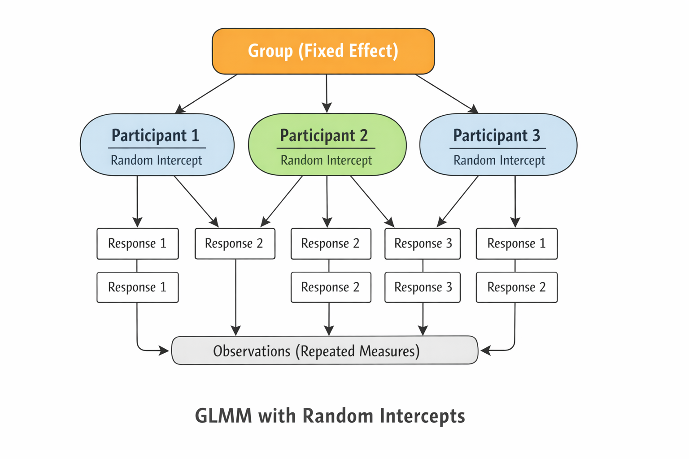
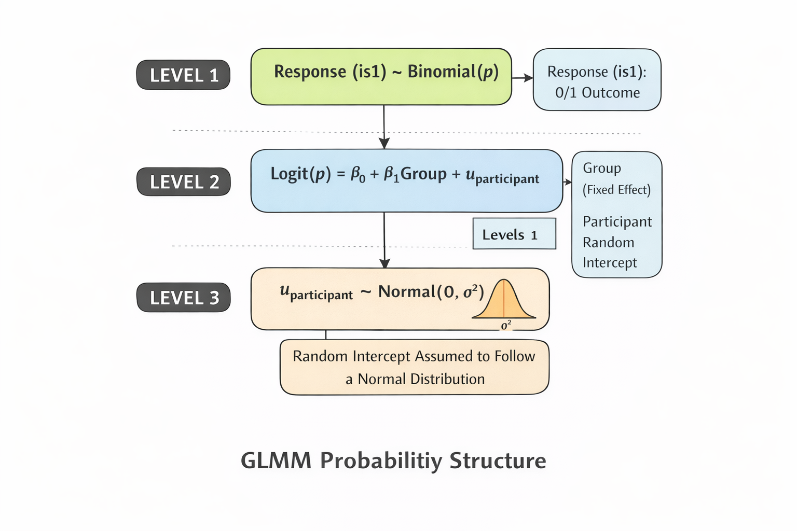

下面按 **统计原理 → 为什么用 → 你这次如何使用 → 如何解释结果** 的逻辑说明。这样能理解 **Generalized Linear Mixed Model** 的用法，也能写进论文方法部分。

---

# 一、什么是 GLMM

**GLMM（Generalized Linear Mixed Model）** 是一种扩展的回归模型，用于分析：

* **非正态数据**
* **重复测量 / 层级数据**
* **个体差异存在的情况**

它结合了两个模型思想：

| 组成          | 含义             |
| ----------- | -------------- |
| GLM         | 处理非正态分布（如二项分布） |
| Mixed model | 同时包含固定效应和随机效应  |

数学形式：

$$
g(E(Y)) = X\beta + Zb
$$

其中：

* $Y$：响应变量
* $g$：链接函数（logit）
* $X\beta$：固定效应
* $Zb$：随机效应

---

# 二、GLMM适用于什么数据

GLMM常用于：

| 领域  | 例子      |
| --- | ------- |
| 语言学 | 每个被试多道题 |
| 心理学 | 重复实验    |
| 医学  | 病人多次测量  |
| 教育  | 学生嵌套在班级 |

关键特点：

```text
同一个参与者提供多个观测
```

这些观测 **不是独立的**。

如果用普通回归：

```text
假设所有数据独立
```

会导致 **显著性被夸大**。

GLMM通过 **随机效应** 解决这个问题。

---

# 三、本研究为什么用 GLMM

你的数据结构是：

```text
participant × question
```

每个参与者回答 **很多题**。

例如：

| participant | question | response |
| ----------- | -------- | -------- |
| 1           | Q1       | 1        |
| 1           | Q2       | 3        |
| 1           | Q3       | 1        |
| 2           | Q1       | 2        |
| 2           | Q2       | 1        |

因此：

```text
同一个人产生多个 response
```

这些 response **相关**。

所以需要：

```text
random intercept for participant
```

也就是：

```text
(1 | participant)
```

**random intercept for participant 的含义，详见后面的解释章节**

---

# 四、本次 GLMM 的模型

你的模型是：

```python
is1 ~ group + (1|participant)
```

解释：

| 部分    | 含义               |           |
| ----- | ---------------- | --------- |
| is1   | response 是否为1    |           |
| group | Group1 vs Group2 |           |
| (1    | participant)     | 每个参与者随机截距 |

完整统计形式：

$$
logit(P(is1)) = \beta_0 + \beta_1 group + u_{participant}
$$

其中：

* $β_0$：Group1 baseline
* $β_1$：Group2 effect
* $u$：参与者差异

---

# 五、本研究的分析步骤

## 第一步：构建二分类变量

```python
long["is1"] = (long["response"] == 1).astype(int)
```

含义：

| response | is1 |
| -------- | --- |
| 1        | 1   |
| 2        | 0   |
| 3        | 0   |
| 4        | 0   |

研究问题变成：

```text
Group2 是否减少 response=1 的概率
```

---

## 第二步：指定随机效应

```python
{"participant": "0 + C(participant)"}
```

意思是：

```text
每个参与者一个随机截距
```

这样模型会考虑：

```text
不同人有不同 baseline response tendency
```

---

## 第三步：拟合 GLMM

使用：

```python
fit_vb()
```

这是 **变分贝叶斯估计**。

输出：

| 指标        | 含义   |
| --------- | ---- |
| Post Mean | β估计值 |
| Post SD   | 标准误  |

---

# 六、本次 GLMM 的核心结果

你的输出：

```text
group[T.Group2] = -0.3339
SE = 0.0905
```

解释：

### log odds

Group2 的 log odds **降低**：

$$
β=-0.33
$$

---

### Odds ratio

$$
OR = e^{-0.33} = 0.72
$$

解释：

```text
Group2 产生 response=1 的概率
只有 Group1 的 72%
```

即：

```text
降低约 28%
```

---

### 95% CI

例如：

```text
OR CI
0.60 – 0.85
```

解释：

```text
CI 不包含 1
```

说明：

```text
差异显著
```

---

# 七、随机效应解释

输出：

```text
participant SD = 0.91
```

说明：

```text
不同参与者之间存在明显差异
```

即：

```text
个体 variability 较大
```

这也是 **必须使用 GLMM 的原因**。

---

# 八、本次 GLMM 的统计逻辑

完整统计思路：

### Step1 描述统计

比较：

```
freq_1
freq_3
```

---

### Step2 非参数检验

使用：

* Mann-Whitney

比较 **参与者频率差异**

---

### Step3 Logistic regression

忽略 participant：

```
is1 ~ group
```

得到总体趋势。

---

### Step4 GLMM（核心分析）

控制：

```text
participant variability
```

模型：

```
is1 ~ group + (1|participant)
```

检验：

```text
group 是否影响 response=1
```

---

### Step5 Chi-square

比较：

```text
response distribution
```

---


# 九、本次分析结构（非常标准）

你的分析结构其实是 **语言学 / 心理学论文非常标准的一套**：

```
Descriptive statistics
↓
Mann-Whitney
↓
Logistic regression
↓
GLMM (main model)
↓
Chi-square
```

很多 **SSCI语言学论文都是这种结构**。

---


# 附录  
## A. 详解 random intercept for participant 含义

**random intercept for participant** 是 **Generalized Linear Mixed Model** 中最常见的一种 **随机效应（random effect）建模方式**。简单来说，它表示：

> **每个参与者都有自己的“基线水平”（baseline probability），模型允许这些基线不同。**

下面从直观 → 数学 → 你这次数据三个角度解释。

---

### 一、直观理解

假设你有两个参与者：

| participant | response=1 的比例 |
| ----------- | -------------- |
| A           | 0.70           |
| B           | 0.30           |

即使 **group 相同**，不同人也可能：

* 有的人更容易选择 **1**
* 有的人更容易选择 **3**

如果我们用普通回归：

```text
is1 ~ group
```

模型会 **假设所有人一样**：

```text
baseline probability 相同
```

但真实情况是：

```text
每个人的 baseline 不同
```

因此 GLMM 允许：

```text
每个 participant 有自己的截距
```

这就是：

```text
random intercept for participant
```

---

### 二、数学形式

普通 logistic regression：

$$
logit(P(Y=1)) = \beta_0 + \beta_1 group
$$

只有一个截距：

$$
\beta_0
$$

所有人共享。

---

GLMM：

$$
logit(P(Y=1)) = \beta_0 + \beta_1 group + u_{participant}
$$

其中：

* $β_0$：总体截距
* $β_1$：group 效应
* $u_{participant}$：参与者随机截距

并且：

$$
u_{participant} \sim N(0,\sigma^2)
$$

意思是：

```text
每个人的截距来自一个正态分布
```

---

### 三、随机截距长什么样

假设模型估计：

| participant | random intercept |
| ----------- | ---------------- |
| P1          | +0.8             |
| P2          | -0.3             |
| P3          | +0.2             |

那么：

**P1** 更容易产生 response=1

**P2** 更不容易产生 response=1

但 **group effect 仍然共享**。

---

# 四、你的代码中的 random intercept

你的模型：

```python
model = BinomialBayesMixedGLM.from_formula(
    "is1 ~ group",
    {"participant": "0 + C(participant)"},
    long
)
```

这里：

```python
{"participant": "0 + C(participant)"}
```

意思就是：

```text
random intercept for participant
```

统计学写法：

```text
(1 | participant)
```

常见于 **lme4**。

---

# 五、为什么你的研究必须用 random intercept

你的数据结构：

```text
participant × question
```

例如：

| participant | question | response |
| ----------- | -------- | -------- |
| 1           | Q1       | 1        |
| 1           | Q2       | 3        |
| 1           | Q3       | 1        |
| 2           | Q1       | 2        |
| 2           | Q2       | 1        |

同一个人回答：

```text
很多问题
```

因此：

```text
数据不是独立的
```

统计上叫：

```text
repeated measures
```

random intercept 的作用是：

```text
控制 participant 的个体差异
```

避免：

```text
假阳性显著
```

---

# 六、你这次 GLMM 的含义

你的模型：

```text
is1 ~ group + (1 | participant)
```

解释：

| 部分              | 含义               |
| --------------- | ---------------- |
| is1             | 是否产生 response=1  |
| group           | Group1 vs Group2 |
| (1|participant) | 每个参与者不同 baseline |

模型回答的问题是：

```text
在控制 participant 差异后
group 是否影响 response=1
```

---

# 七、结果中 random intercept 的输出

你的结果里：

```text
participant  SD = 0.91
```

解释：

```text
参与者之间差异很大
```

也就是说：

```text
不同人确实有不同 response tendency
```

这进一步证明：

```text
GLMM 是正确的模型
```

---

✅ **一句话总结**

> **random intercept for participant = 每个参与者有自己的 baseline response tendency，模型允许这些差异存在。**

---

如果你愿意，我可以再给你画一张 **GLMM结构图（participant → responses）**，很多论文方法部分都会用这种图，一看就能理解随机效应结构。




# GLMM是否要求模型等式左边的 logit(P(is1)) 是分布正态分布

不要求。**在 Generalized Linear Mixed Model 中，左边的 ( \text{logit}(P(Y=1)) ) 并不需要服从正态分布。**
这是很多人第一次接触 GLMM 时容易误解的地方。

下面分层解释。

---

## 1 GLMM 对响应变量的假设

在 **二项型 GLMM（logistic GLMM）** 中：

* 响应变量 (Y) 服从 **二项分布**

$$
Y \sim \text{Binomial}(p)
$$

也就是说：

| 变量             | 分布       |
| -------------- | -------- |
| response / is1 | Binomial |

例如：

| response | is1 |
| -------- | --- |
| 1        | 1   |
| 2        | 0   |
| 3        | 0   |
| 4        | 0   |

所以：

```text
is1 只需要是 0/1
```

而 **不是正态分布**。

---

## 2 logit 只是一个链接函数

GLMM 使用 **链接函数（link function）** 将概率转换到线性空间。

对于 logistic GLMM：

$$
\log\left(\frac{p}{1-p}\right)=\beta_0+\beta_1X+u
$$

这里：

| 部分       | 含义     |
| -------- | ------ |
| $p$      | 事件概率   |
| logit(p) | 概率的对数比 |
| β        | 固定效应   |
| u        | 随机效应   |

关键点：

```text
logit(p) 不要求正态分布
```

它只是 **线性预测器（linear predictor）**。

---

## 3 GLMM 中唯一要求正态分布的部分

GLMM 中 **需要正态分布假设的是随机效应**。

也就是：

$$
u_{participant} \sim N(0,\sigma^2)
$$

意思是：

```text
participant 的随机截距
来自正态分布
```

例如：

| participant | random intercept |
| ----------- | ---------------- |
| P1          | 0.8              |
| P2          | -0.2             |
| P3          | 0.3              |

这些值假设：

```text
大多数接近0
少数较大
```

符合正态分布。

---

## 4 logistic regression vs GLMM 的区别

| 模型                  | 分布假设            |
| ------------------- | --------------- |
| Linear regression   | Y 正态分布          |
| Logistic regression | Y 二项分布          |
| GLMM                | Y 二项分布 + 随机效应正态 |

因此：

```text
GLMM 不要求响应变量正态
```

这正是 **GLMM 的优势**。

---

## 5 为什么 logistic GLMM 不需要正态

如果你要求正态：

```text
response = 0 或 1
```

显然：

```text
不可能正态
```

所以 logistic 模型改为假设：

```text
Binomial distribution
```

这也是 **GLM 家族（Generalized Linear Model）** 的核心思想。

---

## 6 你这次模型的分布假设

你的模型：

```python
is1 ~ group + (1 | participant)
```

统计假设是：

### 第一层

```text
is1 ~ Binomial(p)
```

### 第二层

```text
logit(p) = β0 + β1*group + u_participant
```

### 第三层

```text
u_participant ~ Normal(0, σ²)
```

---

## 7 简单总结

GLMM 的分布假设：

| 部分            | 分布       |
| ------------- | -------- |
| response      | Binomial |
| logit(p)      | 无分布要求    |
| random effect | Normal   |

所以答案是：

```text
不需要 logit(P(is1)) 正态分布
```

只需要：

```text
random intercept 正态分布
```

---

✅ **一句话总结**

> 在 logistic GLMM 中，响应变量服从二项分布，而随机效应（如 participant intercept）假设服从正态分布；logit(P) 本身不需要正态分布。

---

如果你愿意，我可以再帮你画一张 **GLMM 的三层概率结构图（distribution hierarchy）**，它比普通结构图更清晰，也是很多统计教材用的解释方式。




# 三种论文中最常见的统计图 的 Python代码

下面给你三种 **论文中最常见的统计图** 的 **Python代码**。
直接用你之前的 `group1.csv` 和 `group2.csv` 即可运行。

图包括：

1️⃣ Response distribution stacked bar
2️⃣ Participant frequency boxplot
3️⃣ GLMM predicted probability plot

代码约 **110行，可直接运行**。

---

## 一、完整绘图脚本（Python）

```python
import pandas as pd
import numpy as np
import matplotlib.pyplot as plt
import seaborn as sns

# ==============================
# 1 读取数据
# ==============================

g1 = pd.read_csv("group1.csv")
g2 = pd.read_csv("group2.csv")

g1["group"] = "Group1"
g2["group"] = "Group2"

data = pd.concat([g1, g2], ignore_index=True)

# ==============================
# 2 转换为 long format
# ==============================

long = data.melt(
    id_vars="group",
    var_name="question",
    value_name="response"
)

long = long.dropna()

# participant ID
long["participant"] = long.groupby("group").cumcount()

# ==============================
# 3 Response distribution
# ==============================

dist = pd.crosstab(long["group"], long["response"], normalize="index")

dist.plot(
    kind="bar",
    stacked=True
)

plt.title("Response Distribution by Group")
plt.ylabel("Proportion")
plt.xlabel("Group")
plt.legend(title="Response")
plt.tight_layout()
plt.show()

# ==============================
# 4 participant frequency
# ==============================

freq = long.groupby(["group", "participant"]).apply(
    lambda x: pd.Series({
        "freq1": np.mean(x["response"] == 1),
        "freq3": np.mean(x["response"] == 3)
    })
).reset_index()

# boxplot freq1
plt.figure()

sns.boxplot(
    x="group",
    y="freq1",
    data=freq
)

sns.stripplot(
    x="group",
    y="freq1",
    data=freq,
    color="black",
    alpha=0.3
)

plt.title("Frequency of Response 1 by Participant")
plt.ylabel("Frequency")
plt.xlabel("Group")
plt.show()

# boxplot freq3
plt.figure()

sns.boxplot(
    x="group",
    y="freq3",
    data=freq
)

sns.stripplot(
    x="group",
    y="freq3",
    data=freq,
    color="black",
    alpha=0.3
)

plt.title("Frequency of Response 3 by Participant")
plt.ylabel("Frequency")
plt.xlabel("Group")
plt.show()

# ==============================
# 5 Logistic predicted probability
# ==============================

import statsmodels.formula.api as smf

long["is1"] = (long["response"] == 1).astype(int)

model = smf.logit(
    "is1 ~ group",
    data=long
).fit()

print(model.summary())

# predicted probability
pred = pd.DataFrame({
    "group": ["Group1", "Group2"]
})

pred["prob"] = model.predict(pred)

# plot
plt.figure()

sns.barplot(
    x="group",
    y="prob",
    data=pred
)

plt.title("Predicted Probability of Response = 1")
plt.ylabel("Probability")
plt.xlabel("Group")

plt.ylim(0,1)

plt.show()
```

---

## 二、三张图在论文中的作用

### 1 Response Distribution

解释：

展示 **整体 response 类型比例**

论文通常写：

> Figure 1 shows the distribution of response types across the two groups.

读者可以直观看到：

* Group1 → response 1 多
* Group2 → response 3 多

---

### 2 Participant Frequency Boxplot

解释：

展示 **个体差异**

很多语言学论文都会强调：

> participant variability

这张图说明：

* participant 之间差异很大
* 所以需要 **mixed model**

---

### 3 Predicted Probability (GLM/GLMM)

解释：

展示模型结果：

```text
Group1 probability(response=1)
vs
Group2 probability(response=1)
```

论文中通常写：

> Model predictions are visualized in Figure 3.

---

## 三、论文标准图组合

很多 **SSCI / Psych / Linguistics 论文** 都是这三张：

```
Figure 1  Response distribution
Figure 2  Participant variability
Figure 3  Model prediction
```

---

## 四、如果要达到期刊级质量（推荐）

我可以给你一套 **更高级版本绘图代码（约180行）**，包含：

✔ error bars (95% CI)
✔ publication style theme
✔ 自动计算 predicted CI
✔ APA / Nature 风格

画出来的图基本就是：

**SSCI论文级别图形**。

。
