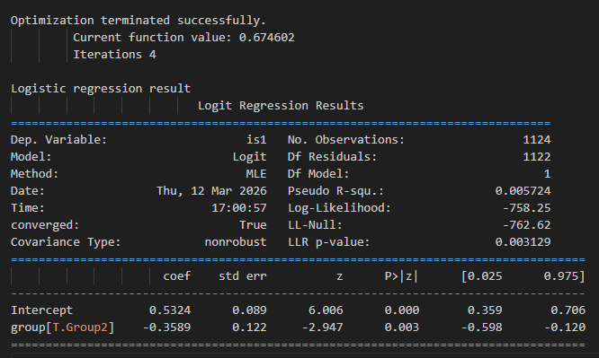

# A、逻辑回归分析示例

下面这段代码使用了 Python 的 statsmodels 库来进行 逻辑回归分析。

```python
model = smf.logit("is1 ~ group", data=long).fit()
```

这段代码使用了 Python 的 `statsmodels` 库来进行 **逻辑回归分析**。

它用于研究一个二分类的结果（是/否）与一个分组变量（比如实验组/对照组）之间的关系。

以下是详细的代码拆解：

### 1. `smf.logit(...)`
*   **含义**：调用 `statsmodels.formula.api`（通常简写为 `smf`）中的 `logit` 函数。
*   **作用**：指定模型类型为 **逻辑回归**。逻辑回归适用于因变量是二分类变量（只有两个值，如 0/1, 是/否, 发生/未发生）的情况。

### 2. `"is1 ~ group"` （公式部分）
这是 R 语言风格的回归公式，定义了模型的结构：

*   **`~` 左边**：因变量。
    *   `is1`：这是你要预测的目标变量。它必须是二分类的（例如：0代表否，1代表是）。根据变量名推测，它可能代表“是否选择了选项1”或“是否发生某事”。
*   **`~` 右边**：自变量。
    *   `group`：这是预测因子。它通常是一个分类变量（例如：对照组 vs 实验组）。
*   **含义**：模型试图探究 `group`（组别）是否能显著预测 `is1` 的发生概率。例如：实验组是否比对照组更容易出现 `is1=1` 的情况？

### 3. `data=long`
*   **含义**：指定模型使用的数据来源。
*   **作用**：告诉程序去名为 `long` 的 DataFrame 中寻找 `is1` 和 `group` 这两列数据。

### 4. `.fit()`
*   **含义**：模型拟合。
*   **作用**：这是实际执行计算的步骤。程序会根据数据，通过最大似然估计法来计算出回归系数，使得模型最能解释观察到的数据。

### 总结与推测
这行代码的上下文逻辑通常是这样的：

1.  数据来源于dataframe long，格式如下：
    | participant	| group	| question	| response	| is1   | 
    | --- | ---| ---| ---| ----|
    | 0	| 0	| Group1	| category_1	| 1.0	| 1| 
    | 1	| 1	| Group1	| category_1	| 1.0	| 1| 
    | 2	| 2	| Group1	| category_1	| 3.0	| 0| 
    | ...	| ...	| ...	| ...	| ...	| ...| 
    | 11083	| 235	| Group2	| category_33	| 1.0	| 1| 
    | 11099	| 251	| Group2	| category_33	| 3.0	| 0| 
    | 11438	| 251	| Group2	| category_34	| 3.0	| 0 

2.  **因变量生成**：在这之前做了如下筛选操作，使得因变量列“is1”是二分类变量：
    ```python
    # 筛选出 response=1 的数据，并将答案转换为0/1
    long["is1"] = (long["response"] == 1).astype(int)
    ```
3.  然后运行了这行代码：
    ```python
    model = smf.logit("is1 ~ group", data=data_q1).fit()
    ```
    这意味着：**对不同组别的 "response=1" 发生概率与自变量（group）之间的关系进行逻辑回归建模。** 
  

# B、 逻辑回归因变量是二分类变量，自变量需要是二分类变量吗？
**不需要。**

在逻辑回归中，**因变量必须是二分类变量**，但**自变量可以是非常灵活的类型**，包括二分类、多分类（多于两个类别）或连续数值变量。

以下是详细的解释：

### 1. 自变量是二分类变量
这是最简单的情况，就像你刚才代码中的 `group`。
*   **例子**：`group`（0=对照组，1=实验组）。
*   **结果**：模型会计算实验组相对于对照组，发生结果的概率差异。

### 2. 自变量是多分类变量
自变量的类别可以超过两个。
*   **例子**：`group` 有三个水平（对照组、低剂量组、高剂量组）。
*   **处理方式**：你不能直接放入变量，通常需要进行**虚拟变量编码**。
    *   如果你使用 `statsmodels` 的公式接口（就像你写的 `smf.logit`），它会**自动处理**。
    *   它会将其转换为多个二分类变量（例如：`group[T.低剂量]` 和 `group[T.高剂量]`），并选择其中一个作为参考基准。

### 3. 自变量是连续数值变量
这是非常常见的情况。
*   **例子**：你想预测“是否患病”（二分类因变量），自变量是“年龄”（连续数值）。
*   **代码**：`smf.logit("is1 ~ age", data=long).fit()`
*   **结果**：模型会输出年龄每增加1岁，患病概率的变化趋势。

### 4. 自变量是混合类型
你可以在一个模型里同时包含多种类型的自变量。
*   **公式**：`"is1 ~ group + age + score"`
    *   `group`：二分类或多分类。
    *   `age`：连续数值。
    *   `score`：连续数值。

### 总结

| 变量角色 | 要求 | 说明 |
| :--- | :--- | :--- |
| **因变量** | **必须是二分类** | (0/1, 是/否, 成功/失败)。如果不是，不能用标准逻辑回归。 |
| **自变量** | **任意类型** | 可以是二分类、多分类、连续数值，甚至交互项 (`group * age`)。 |

所以，你的自变量完全不受限制，只要你的因变量是 0/1 这样的二分类数据，逻辑回归就是适用的。

# C、逻辑回归结果解析

```python
print("\nLogistic regression result")
print(model.summary())
```
得到逻辑回归结果如下：

Optimization terminated successfully.
         Current function value: 0.674602
         Iterations 4

Logistic regression result
                           Logit Regression Results                           
==============================================================================
Dep. Variable:                    is1   No. Observations:                 1124
Model:                          Logit   Df Residuals:                     1122
Method:                           MLE   Df Model:                            1
Date:                Thu, 12 Mar 2026   Pseudo R-squ.:                0.005724
Time:                        17:00:57   Log-Likelihood:                -758.25
converged:                       True   LL-Null:                       -762.62
Covariance Type:            nonrobust   LLR p-value:                  0.003129
===================================================================================
                      coef    std err          z      P>|z|      [0.025      0.975]
-----------------------------------------------------------------------------------
Intercept           0.5324      0.089      6.006      0.000       0.359       0.706
group[T.Group2]    -0.3589      0.122     -2.947      0.003      -0.598      -0.120
===================================================================================



我们从上到下逐块解读，重点关注**系数**和**P值**。

### 1. 模型整体状况
*   **Optimization terminated successfully**: 模型计算收敛成功，没有报错。
*   **No. Observations: 1124**: 样本量是 1124 个，样本量足够大。
*   **Pseudo R-squ.: 0.005724**: 伪R方。在逻辑回归中，这个值通常比较小（不像线性回归那样接近1才好）。0.0057 说明模型解释了因变量变异的一小部分。这很常见，特别是在社会科学或医学数据中，说明还有很多其他因素影响结果。
*   **LLR p-value: 0.003129**: **模型整体显著性**。这个值远小于 0.05，说明你的模型作为一个整体是显著的，即 `group` 对 `is1` 有显著的预测能力。

### 2. 核心结果解读

这是表格中最关键的部分：

#### 截距项
*   **coef (系数): 0.5324**
*   **P>|z|: 0.000** (极其显著)
*   **含义**：这代表了**基准组（对照组，即 Group1）** 的对数发生比。
    *   我们可以将其转换为概率。基准组发生 `is1=1` 的概率大约为：
        $$ P = \frac{e^{0.5324}}{1 + e^{0.5324}} \approx \frac{1.70}{2.70} \approx 63\% $$
    *   这说明对照组中有约 63% 的人出现了 `is1=1` 的情况。

#### 分组项
*   **coef (系数): -0.3589**
    *   系数是**负数**，这意味着：相比于 Group1，Group2 发生 `is1=1` 的概率更低（负相关）。
    *   具体来说，Group2 的对数发生比比 Group1 低 0.3589。
*   **P>|z|: 0.003**
    *   **这是核心结论指标**。
    *   P值为 0.003，远小于显著性水平 0.05。这意味着两组之间的差异具有**统计学显著性**。
    *   结论：Group2 与 Group1 在 `is1` 上存在显著差异。
*   **置信区间 [0.025 0.975]: [-0.598, -0.120]**
    *   95%置信区间不包含 0（全在负数区间），进一步验证了结果的显著性。

### 3. 如何用通俗语言总结结论？

你可以这样汇报结果：

> “逻辑回归分析结果显示，组别对结果有显著影响（p = 0.003）。与 Group1 相比，Group2 发生结果的概率显著降低。具体而言，Group1 的预测概率约为 63%，而 Group2 的对数发生比比 Group1 低 0.36 个单位。”

### 补充：如何计算 Group2 的概率？
如果你想算出 Group2 具体的概率：
1.  Group2 的总 log-odds = 截距 + group系数 = $0.5324 + (-0.3589)*1 = 0.1735$
2.  转换为概率：$P = \frac{e^{0.1735}}{1 + e^{0.1735}} \approx \frac{1.19}{2.19} \approx 54.3\%$

**结论**：Group1 的概率约 63%，Group2 的概率约 54%，这 9% 的差异在统计学上是显著的。

# D、 为什么用Intercept 系数可以直接计算Group1 中，发生 is1=1 的概率？
这是一个非常好的问题，触及了逻辑回归的核心原理。我们来分步拆解。

### 一、 拟合的数学公式

逻辑回归的数学形式由两部分组成：**线性部分**和**变换部分**。

#### 1. 线性部分
这与你熟悉的线性回归很像，表示自变量的线性组合：

$$ z = \beta_0 + \beta_1 \times x $$

在你的代码中：
*   $\beta_0$ 是 **Intercept**（截距）。
*   $\beta_1$ 是 **group[T.Group2]** 的系数。
*   $x$ 是分组变量。当数据属于 Group1 时，$x=0$；当数据属于 Group2 时，$x=1$（这是虚拟变量编码的处理）。

#### 2. 变换部分
逻辑回归不会直接预测概率 $P$，而是预测概率的某种变换形式——**对数几率**。

$$ \ln\left(\frac{P}{1-P}\right) = \beta_0 + \beta_1 x $$

或者反过来写，表示概率 $P$ 与线性部分的关系（使用 Sigmoid 函数）：

$$ P = \frac{1}{1 + e^{-(\beta_0 + \beta_1 x)}} = \frac{e^{\beta_0 + \beta_1 x}}{1 + e^{\beta_0 + \beta_1 x}} $$

这就是 `smf.logit` 拟合的完整数学公式。

---

### 二、 为什么用 Intercept 系数可以直接计算 Group1 的概率？

关键在于**虚拟变量编码**。

在你的数据中，`group` 是一个分类变量。统计软件（Pandas/Statsmodels）在处理它时，会自动将其转化为“哑变量”：

*   如果某行数据属于 **Group1**（基准组），则 $x = 0$。
*   如果某行数据属于 **Group2**，则 $x = 1$。

让我们把 $x=0$ 代入上面的公式看看会发生什么：

#### 1. 代入线性公式
当 $x=0$ 时：
$$ \text{Log-odds} = \beta_0 + \beta_1 \times 0 = \beta_0 $$
**结论**：截距 $\beta_0$ 实际上就是基准组（Group1）的对数几率。

#### 2. 转换为概率
既然 Group1 的对数几率是 $\beta_0$，那么 Group1 发生事件的概率 $P_1$ 就是：

$$ P_1 = \frac{e^{\beta_0}}{1 + e^{\beta_0}} $$

这就是为什么你可以直接用 `Intercept` 的系数（取指数后换算）算出 Group1 的概率。

---

### 三、 直观验证（带入你的数据）

你的结果中：
*   **Intercept ($\beta_0$) = 0.5324**
*   **group[T.Group2] ($\beta_1$) = -0.3589**

#### 对于 Group1 ($x=0$):
$$ \ln(\frac{P_1}{1-P_1}) = 0.5324 + (-0.3589 \times 0) = 0.5324 $$

转换为概率：
$$ P_1 = \frac{e^{0.5324}}{1 + e^{0.5324}} = \frac{1.703}{2.703} \approx 0.630 \, (63.0\%) $$

这就是我们在上一题中算出的 Group1 的概率。

#### 对于 Group2 ($x=1$):
$$ \ln(\frac{P_2}{1-P_2}) = 0.5324 + (-0.3589 \times 1) = 0.1735 $$

转换为概率：
$$ P_2 = \frac{e^{0.1735}}{1 + e^{0.1735}} = \frac{1.189}{2.189} \approx 0.543 \, (54.3\%) $$

### 总结
*   **Intercept** 代表了当所有自变量取值为 0 时的基准状态。
*   因为分类变量的基准组被编码为 0，所以 **Intercept 天然代表了基准组的对数几率**。
*   通过 Sigmoid 函数逆变换，就可以直接算出基准组的概率。

# 逻辑回归的输出结果中，group[T.Group2] 是什么？

`group[T.Group2]` 是 Statsmodels 库在处理分类变量时的一种**特定输出格式**。

简单来说，它代表了 **Group2 相对于 Group1（基准组）的效应**。

以下是详细解释：

### 1. 拆解含义

*   **`group`**：这是你数据中的列名。
*   **`T`**：代表 "Treatment"（处理）或 "Treatment Coding"（处理编码/虚拟编码）。这是统计学软件处理分类变量的标准方式。
*   **`Group2`**：这是具体的类别名称。

合起来 `group[T.Group2]` 的意思就是：
> “在 `group` 这个变量中，**Group2** 这一类相对于**基准组**（Reference Group）的变化情况。”

### 2. 为什么会有这个符号？（基准组的奥秘）

当你在逻辑回归中放入一个分类变量（如 `group`），且该变量有两个类别（Group1 和 Group2）时，计算机为了进行数学计算，会把它转换成**虚拟变量**：

*   **Group1**：被设定为**基准组**，编码为 **0**。
*   **Group2**：被设定为**实验组**，编码为 **1**。

因为 Group1 被编码为 0，所以它的效应被“吸收”进了截距项中。模型不需要专门为 Group1 生成一行系数。

模型只需要计算 **Group2 偏离基准组有多远**。

### 3. 对应关系

| 输出项 | 对应的数学含义 |
| :--- | :--- |
| **Intercept** | 代表 **Group1** 的对数几率。 |
| **group[T.Group2]** | 代表 **Group2 与 Group1 的对数几率之差**。 |

### 4. 如果你的数据有三个组？

假设 `group` 有三个类别：Group1, Group2, Group3。结果会变成这样：

*   `Intercept`：代表 Group1（基准组）。
*   `group[T.Group2]`：代表 Group2 相比 Group1 的差异。
*   `group[T.Group3]`：代表 Group3 相比 Group1 的差异。

你会发现，结果中永远不会出现 `group[T.Group1]`，因为它就是那个被大家做比较的“隐形”基准。

### 总结
看到 `group[T.Group2]` 时，你就要反应过来：
1.  这是关于 **Group2** 的系数。
2.  这个系数是与 **Group1**（隐藏的基准组）做对比得出的。
3.  这个系数反映了 Group2 带来的独特影响（在这个例子中是降低了发生概率）。


